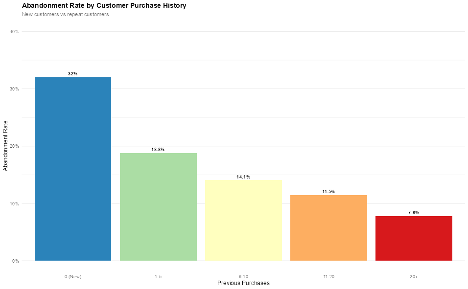

# Project Portfolio MSBA Case Competition: Cart Abandonment

## 👤 Author
**Ethan Aslami**  

---

## 1. Business Problem & Project Objective
> **Aim:** Help Swire Coca-Cola reduce revenue loss from online cart abandonment and increase e-commerce conversion rates on the MyCoke360 platform.

- Swire wanted deeper insight into how to reduce cart abandonment on their new MyCoke360 platform.
- Understanding abandonment patterns reveals customer pain points and operational inefficiencies that Swire can target for changes.
- Improving conversion rates offers immediate ROI without additional customer acquisition costs.
- **Analytical Objective:** Identify the key drivers of cart abandonment and develop a predictive model to flag high-risk sessions, enabling targeted interventions. Provide actionable recommendations for reducing abandonment rates.

> *This project directly connects data science to measurable business outcomes: reducing friction, increasing revenue, and improving customer experience on the new user platform.*

---

## 2. Group Solution Overview
> **Our team developed a machine learning pipeline to predict cart abandonment probability at the session level, combined with exploratory analysis to identify abandonment drivers.**

- We created a new session-level cart abandonment method, which allowed us to look into features at the session level and gain further insights with higher confidence in the abandonment results as well.
- Used a variety of models including Random Forest and XGBoost methods to predict abandonment for customers.
- All analysis was completed in R with markdown and R scripts.

> [!NOTE]  
> The solution balanced predictive accuracy with business interpretability, critical for stakeholder buy-in. This is another reason why we thought the session-level abandonment method was useful because it was easier to interpret.

---

## 3. Individual Contribution

- Created all of the code for defining the session-level abandonment.
- Created reusable R functions for data preprocessing that standardized our group's workflow.
- Supported teammates by reviewing code and resolving bugs.
- Contributed to the modeling section by providing code for XGBoost and Random Forest 5-fold cross-validation.
- Completed many visualizations for the EDA section, looking into factors that drove abandonment.

  

---

## 4. Business Value of the Solution

- Prioritizing high-risk interventions (vs. blanket outreach) reduces customer service costs.
- Improvement of UI to reduce friction can help reduce abandonment.
- Improved identification of customers who are at higher risk of abandoning their carts leads to effective interventions that can increase conversions.

> [!IMPORTANT]  
> We believe that this solution can provide real-time support that will reduce cart abandonment.

---

## 5. Challenges & How We Solved Them

- We completed the cart abandonment using the original definition but found data quality issues with multiple anchor dates for the same order window. 
- The Sales table only used dates (not full timestamps) which made it difficult to look at detailed revenue impact.  
- Working with three people on one notebook can sometimes be challenging, but we were able to make this work by splitting tasks efficiently.
- Work scheduling constraints across the three of us forced us to be organized in our planning and collaboration. 

---

## 6. What I Learned

- I learned a lot about cart abandonment and the things that drive it. 
- Great opportunity to practice modeling methods and visualization options introduced throughout the MSBA program. 
- Collaboration with teammates helped me practice compromising with different opinions and ideas.
- Learned how to translate technical analysis into insights that are meaningful and actionable for non-technical stakeholders.

---
